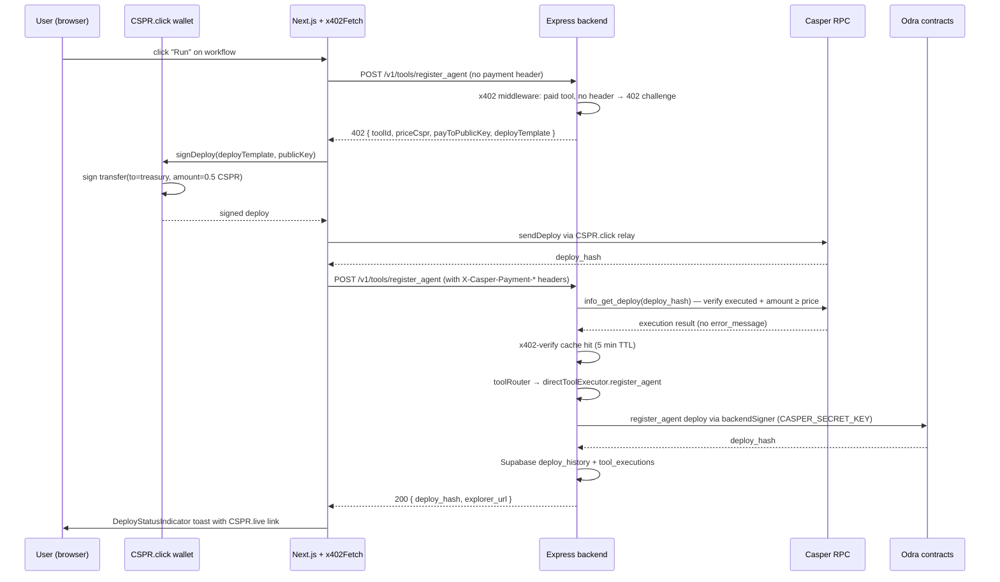

# BlockOps Architecture

This document describes the end-to-end architecture of the BlockOps stack
after the Casper migration.

## High-level diagram

```
                 ┌────────────────────────────────────────────┐
                 │              Browser (Next.js)             │
                 │                                            │
                 │  ┌─────────────┐    ┌─────────────────┐    │
                 │  │ React Flow  │    │ Agent Wallet    │    │
                 │  │ workflow    │    │ (CSPR.click)    │    │
                 │  │ builder     │    │ multi-account   │    │
                 │  └──────┬──────┘    │ session restore │    │
                 │         │           │ error mapper    │    │
                 │         │           └────────┬────────┘    │
                 │         │                    │             │
                 │  ┌──────▼──────┐    ┌────────▼────────┐    │
                 │  │ x402-client │    │ Deploy status   │    │
                 │  │ (auto-sign  │    │ toast (RPC      │    │
                 │  │ + retry)    │    │ polling)        │    │
                 │  └──────┬──────┘    └─────────────────┘    │
                 └─────────┼──────────────────────────────────┘
                           │ HTTPS
                           ▼
                 ┌────────────────────────────────────────────┐
                 │           Express Backend (Node)          │
                 │                                            │
                 │  ┌──────────────┐  ┌────────────────────┐  │
                 │  │ Middleware   │  │ Services           │  │
                 │  │              │  │                    │  │
                 │  │ • x402       │  │ • toolRouter       │  │
                 │  │   challenge  │  │ • directToolExec   │  │
                 │  │ • x402       │  │ • contractDeploy   │  │
                 │  │   verify     │  │ • aiService        │  │
                 │  │ • requestCtx │  │ • emailService     │  │
                 │  │ • rate limit │  │ • webhookService   │  │
                 │  │ • zod        │  │ • telegramService  │  │
                 │  │   validate   │  │                    │  │
                 │  └──────┬───────┘  └─────────┬──────────┘  │
                 └─────────┼────────────────────┼─────────────┘
                           │                    │
              ┌────────────▼──────────┐  ┌──────▼────────┐
              │ Casper Testnet        │  │ Supabase      │
              │ + CSPR.cloud          │  │ (Postgres)    │
              │ + 6 Odra contracts    │  │ deploy_history│
              │ (AgentFactory,        │  │ tool_executions│
              │  Reputation, Escrow,  │  │ reputation_…  │
              │  Compliance, Cep18,   │  │ users         │
              │  Cep78)               │  └───────────────┘
              └───────────────────────┘
                           ▲
                           │ JSON-RPC
                           │
                 ┌─────────┴────────┐
                 │  MCP Server      │
                 │  (Python)        │
                 │                  │
                 │  stdio ← n8n     │
                 │  HTTP/SSE ←      │
                 │  LangGraph /     │
                 │  CrewAI agents   │
                  └──────────────────┘
```

## Backend controllers & services

The Express backend is **Casper-only** after Phase 23. The 11 EVM-only
controllers (allowance, batch, bridge, chain, ens, gas, nlExecutor,
portfolio, schedule, swap, wallet), their routes, and the
`agentCoordinator` / `agentRuntime` services were deleted; the
`safeRequire` shim that wrapped them is gone and all remaining routes
are eagerly loaded.

### Casper controllers (`backend/controllers/`)

| Controller                  | Purpose                                                |
| --------------------------- | ------------------------------------------------------ |
| `agentController.js`        | Supabase agent CRUD (create, list, get, update, delete, regenerate API key) + Casper manifest |
| `agentRegistryController.js`| Agent registry + audit-log lookups (Filecoin archival was removed in Phase 13) |
| `contractChatController.js` | AI chat about a deployed contract                       |
| `conversationController.js` | Casper chat — direct tool execution via the v1 router   |
| `emailController.js`        | Plain-text / HTML email sending                         |
| `nftController.js`          | CEP-78 NFT deploy + mint + info (Casper SDK)           |
| `priceController.js`        | CSPR / token price fetcher via CSPR.cloud              |
| `reminderController.js`     | Cron-like reminder jobs that call tools on a schedule  |
| `tokenController.js`        | CEP-18 token deploy + balance / info lookups            |
| `transferController.js`     | Native CSPR transfer helper                            |
| `webhookController.js`      | Webhook registration + delivery for agent events       |

### Casper services (`backend/services/`)

| Service                          | Purpose                                                |
| -------------------------------- | ------------------------------------------------------ |
| `aiService.js`                   | Groq + Gemini LLM adapters                             |
| `backendSigner.js`               | Production signer (CASPER_SECRET_KEY → signing key)    |
| `contractDeploymentService.js`   | CEP-18 / CEP-78 deploy helpers (replaces the EVM Solidity compiler) |
| `directToolExecutor.js`          | Sequential / parallel step execution for the tool router |
| `emailService.js`                | Nodemailer wrapper                                      |
| `reminderIntent.js`              | AI-assisted "remind me to …" intent detection          |
| `telegramService.js`             | Long-polling / webhook Telegram bot                    |
| `toolAuditLogService.js`         | Supabase + sanitized audit-log writer                  |
| `toolRouter.js`                  | 19 Casper tools catalog + AI routing prompt            |
| `webhookService.js`              | Webhook event delivery                                  |

The Phase 22 e2e script (`scripts/e2e-testnet.mjs` with `--dryrun` /
`--live` modes) exercises the full tool surface end-to-end.


## Casper transaction flow

1. **User connects** via CSPR.click (browser wallet popup, no seed phrase).
   The public key is saved to `users.wallet_address` / `users.ed25519_public_key`.

2. **User drags a tool** (e.g. "register_agent") onto the React Flow canvas.

3. **User clicks Run** → the workflow executor calls
   `x402Fetch(/v1/tools/register_agent, …)`.

4. **Backend (no payment header) responds 402** with the x402 challenge:
   ```json
   {
     "toolId": "register_agent",
     "priceCspr": "0.50",
     "priceMotes": "500000000",
     "payToPublicKey": "010101…",
     "deployTemplate": {
       "contractHash": "hash-…",
       "entryPoint": "transfer",
       "args": { "recipient": "010101…", "amount": "500000000" }
     }
   }
   ```

5. **Frontend signs + broadcasts** the payment deploy via CSPR.click
   (`signDeploy` → `sendDeploy`). The resulting `deployHash` is surfaced
   in a `DeployStatusIndicator` toast.

6. **Frontend retries** the original tool request with
   `X-Casper-Payment-Deploy-Hash: <hash>` and
   `X-Casper-Payment-Payer-PublicKey: <pk>`.

7. **Backend (x402-verify middleware) verifies** the deploy against the
   Casper RPC: confirmed executed, recipient matches, amount ≥ price.

8. **Backend routes to the tool handler** (`toolRouter.js` →
   `directToolExecutor.js` for native handlers, or to a specific
   service like `contractDeploymentService.js` for deploys).

9. **Handler builds + signs the tool's deploy** (e.g. for `register_agent`,
   it builds an `agentFactory.register_agent` deploy). The signing key
   can be the user (browser) or the operator (`CASPER_SECRET_KEY` server
   side). Returns the deploy hash.

10. **Backend persists** the tool call in `tool_executions` and the
    deploy in `deploy_history` (Supabase). The deploy hash is returned
    to the frontend so the user can verify on the explorer.

## Data model

- **`users`**: `id` (Supabase auth uid), `ed25519_public_key`,
  `csprclick_session_id`, `last_connected_at`, `wallet_type = 'csprclick'`
  (CHECK constraint).
- **`deploy_history`**: append-only ledger of every on-chain deploy the
  user (or operator) signed.
- **`tool_executions`**: one row per paid tool invocation, with the
  payment deploy hash as a foreign key.
- **`reputation_events`**: append-only ledger of every attestation /
  slash event on-chain (mirrors on-chain state for fast queries).

## Smart contract architecture

```
               ┌──────────────────────┐
               │   AgentFactory       │
               │                      │
               │ register_agent(id,   │
               │   metadata_uri,      │
               │   owner)             │
               │                      │  v1.0
               │ set_paused(bool) ◄───┤  emergency pause
               │ transfer_ownership() │  rotate owner
               └──────────┬───────────┘
                          │
               ┌──────────▼───────────┐         ┌──────────────────┐
               │   Reputation         │         │   Escrow         │
               │                      │         │                  │
               │ attest_agent(id,     │         │ deposit(agent,   │
               │   score, evidence)   │         │   amount)        │
               │ log_success/failure  │         │ execute_payout(  │
               │ set_rating(id, val)  │         │   agent)         │
               │ get_rating(id)       │         │ refund(agent)    │
               │ get_stats(id)        │         │                  │
               │                      │  v1.0   │ set_treasury() ◄─┤  v1.0
               │ 1h cooldown per      │         └──────────────────┘
               │  attester (built-in) │
               └──────────┬───────────┘
                          │
               ┌──────────▼───────────┐
               │   Compliance         │
               │                      │  v1.0 emits
               │ attest_agent(agent,  │  ┌──────────────────┐
               │   verified, uri)     │  │ event_Attest     │
               │ is_compliant(agent)  │  │ event_RevokeAtt.  │
               │ get_attestation_uri  │  └──────────────────┘
               └──────────────────────┘
```

```
               ┌──────────────────────┐
               │   Cep18Token         │  v1.0 emits
               │                      │  ┌──────────────────┐
               │ transfer(recipient,  │  │ event_Burn       │
               │   amount)            │  └──────────────────┘
               │ approve(spender,     │
               │   amount)            │
               │ transfer_from(owner, │
               │   recipient, amount) │
               │ balance_of(owner)    │
               │                      │  v1.0
               │ burn(amount) ◄───────┤  holder burns own balance
               └──────────────────────┘

               ┌──────────────────────┐
               │   Cep78Nft           │  v1.0 emits
               │                      │  ┌──────────────────┐
               │ mint(recipient)      │  │ event_Burn       │
               │ transfer(from, to,   │  └──────────────────┘
               │   token_id)          │
               │ approve(spender,     │
               │   token_id)          │
               │                      │  v1.0
               │ burn(token_id) ◄─────┤  owner / operator burns
               └──────────────────────┘
```

All event names use the `casper_event_standard` format: the on-chain dictionary
key is prefixed with `event_` (e.g. `event_Attest`); CSPR.cloud surfaces the
unprefixed name. See [`docs/API.md` § Odra contract surface](./API.md#odra-contract-surface-v10)
for the full event payload shapes and the v1.0 entry-point authorization rules.

## MCP integration

LangGraph / CrewAI agents connect to the MCP server over **stdio**
(local n8n) or **HTTP/SSE** (remote). The server exposes all 22 tools
with JSON Schema validation. The agent:

1. Calls `tools/list` to discover the 22 tools.
2. Calls `tools/call` with a tool name + JSON params.
3. The MCP server forwards to the BlockOps backend `/v1/tools/:toolId`
   (x402 payment is enforced by the backend, not the MCP layer).

For stateful agents, the MCP server persists session metadata in Redis
and tool-call history in Postgres (`mcp_sessions`, `mcp_tool_calls`).

## Why CSPR.click (not Lit PKP / EOA)?

- **No seed phrase custody**: the secret key never leaves the Casper
  wallet. The frontend only ever sees the public key.
- **Standardized signing**: one SDK works for Casper Wallet, Casper
  Signer, Ledger, MetaMask Snap, and WalletConnect.
- **Real-time deploy status**: CSPR.click broadcasts and waits for
  processing, so the UI can surface the deploy hash + explorer link
  immediately.
- **Casper-native**: no EVM leftovers, no Arbitrum RPC calls, no
  ethers/viem in the build.

## x402 happy path (sequence diagram)



When the tool returns a 5xx error or throws, the `withRefundOnFailure()`
middleware (`backend/middleware/x402-refund.js`) broadcasts a native CSPR
refund from the treasury (signed by `backendSigner`) back to the payer, and
sets `x-casper-refund-deploy-hash` on the response. See [`docs/x402.md`](./x402.md)
for the full challenge shape and refund flow.
