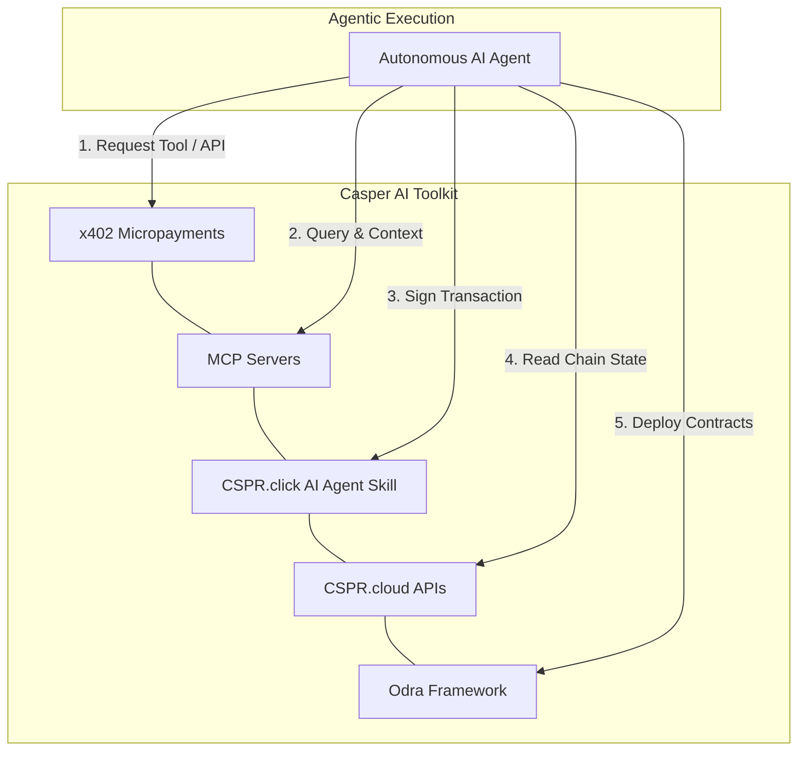

# Casper Agentic Buildathon 2026 & AI Toolkit Developer Guide

Welcome to the comprehensive developer guide for the **Casper Agentic Buildathon 2026** and the **Casper AI Toolkit**. This document acts as the central reference for understanding the buildathon structure, rules, key dates, and technical details on how to build autonomous agentic applications utilizing Casper's specialized developer tooling (including x402 Micropayments, MCP Servers, CSPR.click Agent Skills, CSPR.cloud APIs, and the Odra Framework).

---

## 🏆 Buildathon Overview

The **Casper Agentic Buildathon 2026 - Qualification Round** is hosted by the Casper Association in partnership with DoraHacks and Istanbul Blockchain Week (IBW). It is designed to empower the next generation of Web3 and AI developers to create production-ready applications at the intersection of Agentic AI, Decentralized Finance (DeFi), and Real-World Assets (RWA) on the Casper Network.

### 📅 Key Time Schedule
| Date | Event | Details |
| :--- | :--- | :--- |
| **June 1, 2026** | **Hackathon Launch** | Online buildathon officially begins; Qualification Round opens. |
| **June 2, 2026** | **In-Person Workshop** | Hands-on developer immersion at Istanbul Blockchain Week. |
| **June 30, 2026** | **Submission Deadline** | Qualification Round submissions close at midnight. |
| **July 1–5, 2026** | **Evaluations & Finalists** | Qualification evaluations and finalist selection phase. |
| **July 6–19, 2026** | **Final Round** | Two-week build phase for finalists to polish and expand. |
| **Late July 2026** | **Judging & Demo Day** | Final presentations, demo day, and winner announcements. |

> [!TIP]
> **Workshop & Event Registration Links:**
> - Register for the Istanbul workshop: [Luma Registration](https://luma.com/casper-bzn7)
> - Get a free IBW ticket: [Istanbul Blockchain Week Tickets](https://istanbulblockchainweek.com/tickets/)

### 💰 Prize Pool
* **Total Prize Pool:** **$150,000 USD**
  * **Cash Prizes:** $30,000 USD
  * **x402 Ecosystem Credits:** $100,000 USD
  * **In-kind Co-Sponsor Rewards:** $20,000 USD
* **Non-Financial Support:** Winning teams receive developer mentorship, marketing/ecosystem amplification, and potential grant or incubation opportunities within the Casper Network.

### 🎯 Casper Innovation Track
Participants will build applications that leverage Casper's infrastructure to unlock new financial use cases by combining **Artificial Intelligence** (with a strong emphasis on **Agentic AI**), **Decentralized Finance (DeFi)**, and **Real-World Assets (RWA)**. 

While projects demonstrating the power of Agentic AI in solving real-world problems are particularly encouraged, all well-designed, functional applications that contribute to the Casper ecosystem are welcome.

### 🛡️ Selection & Advancement Mechanism
The buildathon employs a hybrid selection model to select projects advancing to the Final Round:
1. **Community Voting Path:** The top **3 projects** receiving the most votes via the **CSPR.fans** application advance directly to the finals without additional jury evaluation.
2. **Builder Merit Path:** All other submissions must meet the baseline technical eligibility criteria (working prototype on Casper Testnet with a transaction-producing on-chain component) to be evaluated by the professional jury.

---

## 🤖 The Casper AI Toolkit & Developer Resources

Casper provides an ecosystem of tools tailored specifically for autonomous agentic applications. They can be explored fully at [casper.network/ai](https://www.casper.network/ai).

### 1. x402 Micropayments
The **x402 Protocol** is an HTTP-native payment standard (modeled after the `402 Payment Required` HTTP response code) that allows AI agents and services to perform automated pay-per-request transactions on-chain with cryptographic proof.

* **How it works:** 
  1. An agent queries a paid API or tool.
  2. The server returns a `402 Payment Required` challenge containing a `deployTemplate` and price.
  3. The agent signs the template using its wallet/key and broadcasts it to the Casper network.
  4. The agent retries the API call with the `X-Casper-Payment-Deploy-Hash` header.
  5. The backend validates the payment on-chain via Casper RPC before executing the requested action.
* **CasperOPs Integration:** CasperOPs implements this protocol for 11 paid tools (such as `register_agent`, `attest_agent`, `yield_rebalance`, `deploy_cep18`, and `deploy_cep78`), allowing a seamless client-retry mechanism integrated with CSPR.click.
* **Spec Details:** See [docs/x402.md](file:///home/lviffy/Projects/casper/CasperOPs/docs/x402.md) for full implementation details.

### 2. Model Context Protocol (MCP) Servers
Model Context Protocol is an open standard that allows LLMs to interact securely with external tools and data sources. Casper provides specific MCP servers (e.g., Casper MCP Server, CSPR.trade MCP) giving AI agents direct capabilities to query the blockchain, query DEX pool states, perform trades, and manage portfolios.

* **Exposing Tools:** MCP servers act as standard gateways. In CasperOPs, the `n8n_agent_backend` implements an MCP server using stdio and HTTP/SSE transports to expose 22 distinct Casper tools (like transfers, token deploy, and reputation checks) to frameworks like LangGraph and CrewAI.
* **Setup Guide:** See the [MCP Server Guide](file:///home/lviffy/Projects/casper/CasperOPs/n8n_agent_backend/README.md) for execution details.

### 3. CSPR.click AI Agent Skill
The **CSPR.click AI Agent Skill** is an installable execution bundle that grants AI agents the ability to securely manage wallets, prompt users for transaction signatures, and access underlying Casper Network API systems.
* **Seamless Wallet Sign-offs:** Eliminates the need to handle raw seed phrases or complex key orchestration client-side. The agent prompts the CSPR.click wallet interface, ensuring that the user maintains custody and control over transaction approval.

### 4. CSPR.cloud APIs
**CSPR.cloud** is the enterprise-grade middleware infrastructure for the Casper Network, supplying high-performance REST, Streaming (WebSockets), and Node API layers.
* **Application Usage:** Developers use CSPR.cloud to inspect historical transactions, look up account token balances (such as CEP-18 tokens or CEP-78 NFTs), and track real-time blockchain event streams without maintaining heavy local node infrastructures.

### 5. Odra Framework
**Odra Framework** is a developer-friendly smart contract development environment for Rust on the Casper Network.
* **AI-Ready Documentation (`llms.txt`):** Odra integrates built-in support for `llms.txt`, providing structured, LLM-optimized documentation so that AI agents can autonomously generate, compile, and deploy correct smart contracts.
* **CasperOPs Smart Contracts:** CasperOPs uses Odra for its four core contracts: `AgentFactory`, `Reputation`, `Escrow`, and `Compliance`.

---

## 💡 Example Build Directions & Architectures

The buildathon suggests four specific tracks matching the convergence of AI, DeFi, and RWA:

### 1. Autonomous Yield-Routing Agents (via MCP)
* **Goal:** Create an agent that monitors Casper yield opportunities across multiple DeFi protocols.
* **Architecture:**
  * Uses **MCP Servers** to expose contract status and yield tables directly to the LLM.
  * The agent analyzes rates, calculates transaction costs, and decides when to reallocate assets.
  * The **CSPR.click AI Agent Skill** signs the transfer and contract execution deploys to move funds when thresholds are crossed.

### 2. RWA Oracle Agents with Verifiable On-Chain Identity
* **Goal:** A trust-minimized oracle agent that collects real-world data off-chain, conducts risk-assessment, and updates Casper smart contracts.
* **Architecture:**
  * Uses the native **x402 Protocol** to pay/be paid for data delivery per API request.
  * The agent maintains a persistent, reputation-scored on-chain identity (e.g., using the CasperOPs `Reputation` contract).
  * Data submissions are cryptographically signed, ensuring auditable historical data accuracy.

### 3. Multi-Agent DAO Governance & Execution
* **Goal:** A collaborative DAO governance swarm consisting of specialized agents (Risk Agent, Treasury Agent, and Legal Agent) that evaluate proposals and act.
* **Architecture:**
  * Agents debate proposals in natural language.
  * Once consensus is reached, the **Treasury Agent** uses the Casper SDK or MCP tools to build and submit execution deploys.
  * Leverages **Odra-based multisig or governance contracts** to execute funds reallocation.

### 4. AI-Driven Compliance & KYC via Zero-Knowledge
* **Goal:** Privacy-preserving KYC verification where agents evaluate user documentation off-chain and attest on-chain.
* **Architecture:**
  * AI agent processes private documents off-chain and produces a verification proof.
  * The agent posts a compliance attestation on-chain (using Casper's upgradable contract capabilities).
  * Casper's upgradable smart contract system allows the compliance agent to update or revoke status flags dynamically based on continuous off-chain AML monitoring.

---

## ⚡ Casper-Unique Agentic Tool Ideas

To build highly differentiated applications for the Casper Innovation Track, developers can leverage the unique structural advantages of the Casper Network. Here are five Casper-specific tool concepts that directly align with Agentic AI, DeFi, and RWA:

### 1. Native Threshold Governance Manager
* **Casper Feature:** Casper supports **native account weight management and key thresholds** directly on-chain, eliminating the need to deploy complex multi-sig smart contracts.
* **Tool Idea:** An agent-accessible tool that dynamically adjusts account key weights. For example, if a Risk Agent detects anomalies or a fraud flag is raised in a DeFi vault, it executes an account update increasing the key weight required to deploy transactions, locking out simple automated signatures and forcing a manual human administrator signature.

### 2. Autonomous Contract Package Upgrader
* **Casper Feature:** First-class, native contract versioning and contract package keys allow developers to upgrade smart contracts natively without complex proxy patterns.
* **Tool Idea:** An agentic DevOps tool that monitors contract execution logs and performance metrics. If it identifies gas inefficiencies or if a new security patch is released, the AI compiler agent generates, builds, and deploys a contract package upgrade autonomously, recording the transaction hash via the `Attest` event.

### 3. CEP-78 Dynamic Metadata Attestor (RWA Oracle)
* **Casper Feature:** The Casper CEP-78 Enhanced NFT standard supports mutable metadata options natively on-chain.
* **Tool Idea:** A specialized oracle tool for tokenized real-world assets (e.g., tokenized real estate or invoice pools). An AI agent scrapes off-chain valuations, runs financial models, and calls the CEP-78 contract to update metadata variables (e.g., `appraised_value`, `yield_payout`) on-chain. This provides an up-to-date, auditable ledger record of RWA states.

### 4. Time-Bound Delegated Account Signer
* **Casper Feature:** Native key management supports assigning sub-keys with granular permissions.
* **Tool Idea:** A tool that enables users to delegate limited execution rights to an AI agent. The user grants a secondary key (owned by the agent) a specific execution weight. The agent can then autonomously execute transactions under a daily limit (e.g., 50 CSPR) or within a specific time window, while master control of the account remains secure with the user's primary key.

### 5. Casper WASM Gas Profiler & Optimizer
* **Casper Feature:** Casper executes smart contracts written in Rust/WASM, where execution cost is directly determined by WASM instructions.
* **Tool Idea:** An optimizer tool that profiles compiled contract binaries. The compiler agent compiles the smart contract code, runs simulated transactions against a local dev-node, profiles the WASM instructions, and rewrites the underlying Rust logic to optimize loops and state access patterns, ensuring minimal execution fees when deploying.

---

## 🛠️ Developer Checklist & Submission Requirements

To successfully qualify for the final round and professional judging, your project must deliver:

* [ ] **Working Prototype:** Deployed on Casper Testnet containing at least one transaction-producing on-chain smart contract component.
* [ ] **Open-Source Repository:** Hosted on GitHub with a comprehensive `README.md` featuring installation, setup, and usage documentation.
* [ ] **Demo Video:** A public video (YouTube, Loom, etc.) explaining the project's concept, target problem, architecture, features, and a live walkthrough.
* [ ] **Originality & Code of Conduct:** All codebase changes and smart contracts must be original and built during the buildathon period.

---

## 🔗 Official Support Channels & Developer Resources

* **AI Developer Hub:** [Casper AI Portal](https://www.casper.network/ai)
* **Documentation Portal:** [Casper Developer Docs](https://docs.casper.network)
* **Code Repositories:** [Casper Association GitHub](https://github.com/casper-network)
* **Telegram Group:** [Casper Developers Telegram](https://t.me/casperblockchain)
* **Discord Server:** [Casper Discord Server](https://discord.com/invite/casper-network)
