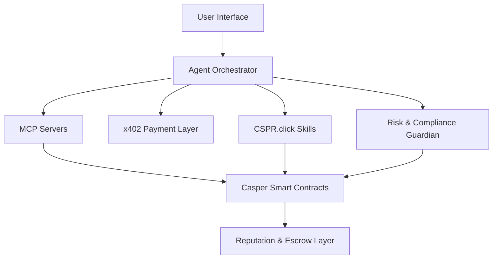

# CasperOPs

### No-Code Platform for Trustworthy Agentic DeFi & RWA on Casper

---

## 🎯 Overview

**CasperOPs** is a no-code and low-code platform that enables anyone—developers, businesses, and non-technical users—to build, deploy, and manage autonomous AI agents for DeFi and Real-World Asset (RWA) workflows on the Casper Network.

By combining visual workflow creation, autonomous agent orchestration, reputation systems, escrow-based trust mechanisms, and Casper’s AI toolkit, CasperOPs makes advanced on-chain automation accessible to everyone.

### Tagline

> **Build. Trust. Deploy. Let Agents Do the Work.**

---

## 🚀 Problem Statement

Building trustworthy autonomous agents for DeFi and RWA applications remains difficult due to:

- Complex smart contract development
- Lack of trust and accountability mechanisms
- Limited access for non-technical users
- Fragmented tooling for AI and blockchain integration
- High risk in autonomous financial operations

CasperOPs solves these challenges through a visual agent-building platform backed by Casper’s infrastructure and trust layers.

---

## ✨ Key Features

### 🎨 Visual No-Code Agent Builder

Create sophisticated AI-powered workflows through a drag-and-drop interface.

#### Prebuilt Templates

- Autonomous Yield Optimizer
- RWA Verification Agent
- Risk Assessment Agent
- Compliance Guardian
- DAO Treasury Executor

#### Natural Language Creation

Users can describe agents using prompts such as:

> "Create an agent that optimizes my liquid-staked assets with low risk."

CasperOPs automatically generates the workflow and required components.

---

### 🛡️ Trust & Reputation Layer

Every agent on the platform is measurable, accountable, and transparent.

Features include:

- On-chain reputation scores
- Agent performance tracking
- Stake-backed trust guarantees
- Escrow-based execution
- Reputation slashing for poor performance
- Verifiable on-chain attestations

---

### 🤖 Autonomous Agent Execution

Powered by Casper's AI ecosystem:

#### MCP Servers

Provide agents with:

- Real-time blockchain data
- Portfolio information
- Yield opportunities
- RWA status updates

#### x402 Micropayments

Enable agents to:

- Purchase premium data
- Access external APIs
- Pay for AI inference
- Execute outcome-based payments

#### CSPR.click Agent Skills

Allow agents to:

- Create wallets
- Sign transactions
- Execute on-chain actions
- Manage assets autonomously

#### Odra Framework

Used for:

- Smart contract generation
- Contract deployment
- AI-friendly development workflows

---

### 💰 DeFi & RWA Automation

CasperOPs is specifically optimized for financial automation use cases.

#### DeFi

- Yield optimization
- Liquidity allocation
- Treasury management
- Risk monitoring
- Automated strategy execution

#### Real-World Assets

- Asset verification
- Compliance monitoring
- Identity validation
- Attestation management
- Token lifecycle automation

---

### 🌐 Agent Marketplace

Discover, publish, and monetize agents.

Capabilities:

- Browse community-created agents
- Performance-based hiring
- Reputation-driven discovery
- Escrow-backed execution
- Community reviews and ratings

---

## 🏗️ System Architecture

### Architecture Components

| Component | Purpose |
| :--- | :--- |
| Frontend Canvas | Visual workflow creation |
| Agent Orchestrator | Coordinates AI agents |
| MCP Servers | On-chain data access |
| x402 | Micropayments and incentives |
| CSPR.click | Wallet and transaction execution |
| Odra Contracts | Smart contract infrastructure |
| Reputation Layer | Agent trust scoring |
| Compliance Guardian | Risk and policy enforcement |

---

## 🛠️ Technology Stack

### Blockchain

- Casper Network (Testnet)

### Smart Contracts

- Odra Framework (Rust)

### AI Infrastructure

- MCP Servers
- x402
- CSPR.click Skills
- CSPR.cloud

### Agent Framework

- LangGraph
- CrewAI

### Frontend

- React
- TypeScript
- TailwindCSS
- React Flow

### Deployment

- Vercel
- Casper Testnet

---

## 🔄 User Flow

### 1. Create

User creates an agent using:

- Drag-and-drop builder
- Natural language prompt

### 2. Configure

Select:

- Data sources
- Risk levels
- Reputation requirements
- Payment conditions

### 3. Deploy

Agent is deployed with:

- Smart contract support
- Reputation profile
- Escrow configuration

### 4. Execute

Agent autonomously:

- Monitors conditions
- Makes decisions
- Executes transactions

### 5. Verify

All actions are:

- Recorded on-chain
- Auditable
- Reputation-scored

---

## 📊 Deployed Contracts

### Agent Factory

Responsible for agent creation and deployment.

### Reputation Contract

Tracks agent performance and trust scores.

### Escrow Contract

Handles stake-backed execution guarantees.

### Compliance Contract

Manages compliance attestations and policy enforcement.
