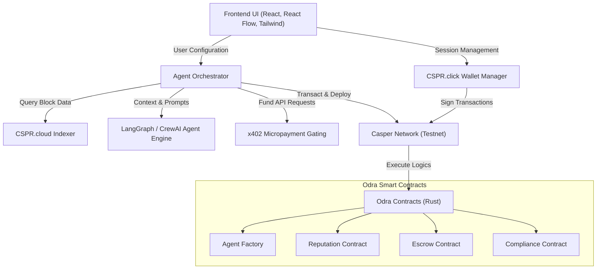

# CasperOPs Technical Architecture & Stack Reference (Casper Network)

This document provides a comprehensive technical breakdown of **CasperOPs** compiled for the **Casper Network**, detailing its architecture, smart contracts, integration protocols, and agent orchestration layer.

---

## 🏗️ High-Level System Architecture

CasperOPs on the Casper Network is designed to orchestrate autonomous AI agents safely, using decentralized credentials, on-chain registries, and micropayment channels.



### End-to-End Request Flow
1. **Compose**: A user designs a custom agent workflow using the React Flow visual builder, or describes it in natural language.
2. **Configure & Connect**: The user logs in via **CSPR.click** and assigns skills (wallets, signing allowances) to the agent.
3. **Escrow Funding**: Capital and execution rewards are deposited into the Odra **Escrow Contract** on the Casper Network to guarantee settlement.
4. **Execution**: The **Agent Orchestrator** loads LLM tools via **MCP Servers** and executes steps (e.g., yield optimizer re-allocation). If external APIs or AI endpoints are required, **x402** micropayments are triggered.
5. **On-Chain Recording**: Transaction proofs are executed on Casper and indexed via **CSPR.cloud**.
6. **Reputation Update**: The **Reputation Contract** logs the execution status (success/failure) and updates the agent's rating score, triggering a payout or refund from the **Escrow Contract**.

---

## 🌐 Casper Network & AI Tooling Integration

CasperOPs relies on Casper's AI toolkit and infrastructure to enable key agent behaviors:

### 1. CSPR.click Agent Skills
* **Role**: Credential and transaction signing delegation.
* **Features**: Allows users to grant specific transaction execution skills (e.g., signing transfers or interacting with yield vaults) to autonomous agents safely, using cryptographic key delegation.

### 2. CSPR.cloud
* **Role**: Blockchain data indexing and query gateway.
* **Features**: Provides rapid access to block state, active validator pools, deployed contract hashes, and historic account actions without overloading raw node RPCs.

### 3. Model Context Protocol (MCP) Servers
* **Role**: Provides real-time context to the agent’s LLM.
* **Features**: Exposes standardized APIs that give LangGraph/CrewAI agents direct visibility into Casper wallet balances, network gas, active smart contracts, and current yield metrics.

### 4. x402 Micropayments
* **Role**: Gated monetization and utility payment.
* **Features**: Enables agents to pay per-use or outcome-based micro-fees (in CSPR) for premium datasets, off-chain API calculations, and LLM inference.

---

## 📄 Smart Contract Architecture (Odra Framework)

All smart contracts in CasperOPs are written in **Rust** using the **Odra Framework** and compiled to WebAssembly (Wasm) for execution on the Casper Network.

```
contract/
├── src/
│   ├── agent_factory.rs      # Factory for agent deployment and initialization
│   ├── reputation.rs         # Agent performance audits and trust scoring
│   ├── escrow.rs             # Stake-backed execution guarantee system
│   ├── compliance.rs         # Attestation management & compliance rules
│   └── lib.rs                # Main compilation unit and contract entrypoints
```

### Contract Components
* **Agent Factory**: Handles permissionless initialization of new agent identities, deploying individual accounts with defined signing restrictions.
* **Reputation Contract**: Records rating evaluations, successful task counts, and failures. Features automated slashing parameters to downgrade malicious or buggy agents.
* **Escrow Contract**: Temporarily locks client funds. Rejects or executes payment payouts depending on the validation outcome of the task.
* **Compliance Contract**: Stores validated identity credentials, KYC statuses, and policy assertions required for Real-World Asset (RWA) compliance checks.

---

## ⚙️ Backend & Agent Engine

* **Frameworks**: LangGraph, CrewAI, Python, FastAPI.
* **Function**: Coordinates the agentic loops. Uses LangGraph to direct structured multi-step plans (e.g., verifying RWA paperwork, fetching compliance rules, deploying a secondary token, and alerting the owner).
* **Communication**: Communicates with the React frontend through WebSockets or JSON REST interfaces.

---

## 🎨 Frontend UI Stack

* **Stack**: React, TypeScript, TailwindCSS, React Flow.
* **Interactive Canvas**: Users drag nodes mapping directly to Casper functionalities:
  * *Transfer Node*: Initiate native CSPR or CEP-18 token transfers.
  * *Deploy Node*: Deploy CEP-18 tokens or CEP-78 NFTs on the Casper Testnet.
  * *Yield Node*: Re-allocate funds to stakers or yield strategies.
  * *Verify Node*: Trigger compliance attestations.
* **Marketplace Page**: An explorer showcasing registered agents, their current reputation scores, historical run logs, and pricing details.
